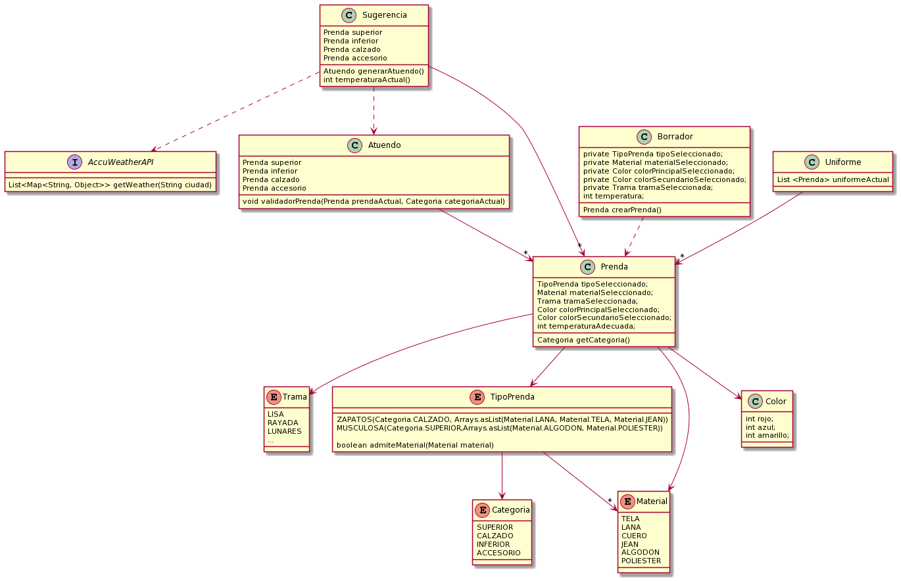

## QMP (2 ITERACION)

# Enunciado: Cuarta Iteracion

En esta oportunidad, atacaremos solamente los siguientes requerimientos específicos:

- Como usuarie de QuéMePongo, quiero poder conocer las condiciones climáticas de Buenos Aires en un momento dado para obtener sugerencias acordes.

- Como usuarie de QuéMePongo, quiero poder recibir sugerencias de atuendos que tengan una prenda para cada categoría, aunque a futuro podrán tener más (Ej.: Una remera, un pantalón, zapatos y un gorro).

- Como usuarie de QuéMePongo, quiero que al generar una sugerencia las prendas sean acordes a la temperatura actual sabiendo que para cada prenda habrá una temperatura hasta la cual es adecuada. (Ej.: “Remera de mangas largas” no es apta a más de 20°C)

- Como administradore de QuéMePongo, quiero poder configurar fácilmente diferentes servicios de obtención del clima para ajustarme a las cambiantes condiciones económicas.

- Como stakeholder de QuéMePongo, quiero poder asegurar la calidad de mi aplicación sin incurrir en costos innecesarios. 

# Resolucion del diseño realizado:
En base a los requerimentos establecidos en el enunciado, realize una alternativa, la cual esta guardada en la carpeta src/main/java/CuartaIteracion.
- La catedra nos provee una API, la cual nos permite obtener la temperatura actual, la cual es de gran utilidad ya que esta va a permitir que la sugerencia valide con una lista de prendas, a ver si estas cumplen la condicion de tener una temperatura consistente con la actual.
- La sugerencia va a primer filtrar el conjunto de prendas que cumplan con la condicion de la temperatura adecuada. 
- Luego se va a seleccionar una prenda de tipo superior, otra de tipo inferior, otra de tipo calzado y otra de tipo accesorio, de manera aleatoria entre las que fueron validadas.
- Y esto permitira luego devolver la prenda en base a las caracteristicas que selecciono la sugerencia. Podria declararse por ejemplo dos sugerencias distintas, y como eligen al azar entre las prendas aptas, podria pasar que a pesar de pasarle la misma lista de prendas, elijan diferentes (lo que seria la idea porque nos gustaria que pueda devolver distintas sugerencias posibles)
- El atuendo al recibir las prendas , esta se encargara de validar que las categorias de las prendas sean consistentes con lo solicitado

# DIAGRAMA DEL DISEÑO REALIZADO

