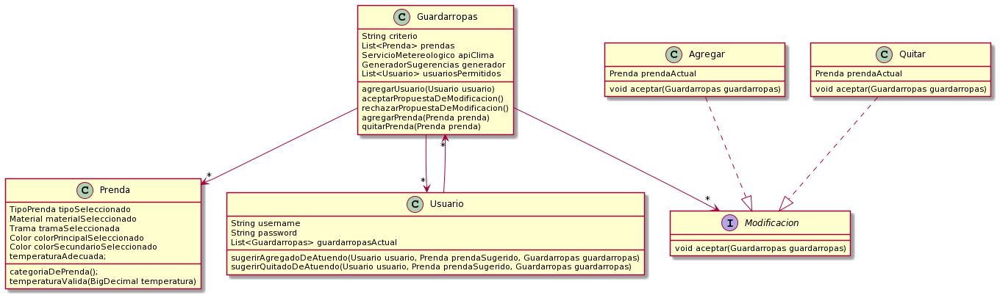

## QMP (2 ITERACION)

# Enunciado: Sexta Iteracion

En esta iteración introduciremos el concepto de “alertas meteorológicas”. Estas alertas son avisos que nos llegan de parte de los proveedores de clima para informarnos de eventos tales como “Granizo” o “Tormenta”. Trabajaremos sobre el siguiente requerimiento:

Como usuarie de QueMePongo quiero poder enterarme si se emitió alguna alerta meteorológica para poder actuar en consecuencia

Inicialmente, comenzaremos atacando solamente los siguientes requerimientos específicos:

- Como usuarie de QueMePongo quiero tener una sugerencia diaria de qué ponerme y que  todas las mañanas, diariamente, esta sea actualizada 

- Como empleade de QueMePongo quiero poder disparar el cálculo de sugerencias diarias para todos los usuarios para poder ejecutar esta acción a principio de cada día.

- Como usuarie de QueMePongo, quiero poder conocer cuáles son las últimas alertas meteorológicas publicadas en el sistema para estar informado (pudiendo verlas, por ejemplo, al entrar en quemepongo.com)

- Como empleade de QueMePongo, necesito poder disparar un proceso que consulte y actualice la lista de alertas publicadas en el sistema para tener control sobre cuándo se publican las mismas 

-Como usuarie de QuéMePongo quiero que se actualice mi sugerencia diaria con las condiciones climáticas actualizadas cuando se genere algún alerta durante el día 

- Como usuarie de QueMePongo quiero tener la posibilidad de que ante una alerta de tormenta la app me notifique que debo llevarme también un paraguas 

- Como usuarie de QueMePongo quiero que ante una alerta meteorológica de granizo la app  me notifique que evite salir en auto

- Como usuarie de QueMePongo quiero poder recibir un mail avisándome si se generó algún alerta meteorológico y cuál

- Como usuarie de QuéMePongo quiero poder configurar cuáles de estas acciones (notificaciones, mail, recálculo) quiero que se ejecuten y cuáles no, además de soportar nuevas acciones a futuro. (No nos interesará, sin embargo, soportar nuevas alertas)

# BONUS

- Como administradore de QueMePongo, quiero que las sugerencias diarias se calculen automáticamente sin que un empleado necesite disparar esta acción manualmente

- Como administradore de QueMePongo, quiero que las alertas se publiquen en el sitio automáticamente sin que un empleado necesite disparar esta acción manualmente

Se cuenta con una nueva operación del SDK de AccuWeather a la que se le puede consultar alertas meteorológicas vigentes 

# Resolucion del diseño realizado:

# DIAGRAMA DEL DISEÑO REALIZADO

